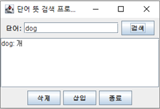
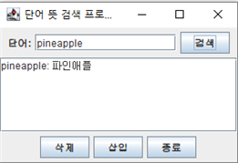
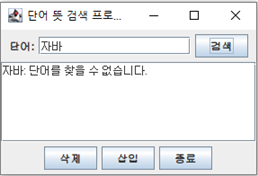
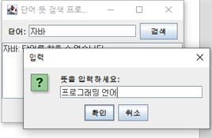
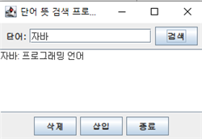
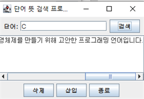

# 📘 WordDictionary - 자바 GUI 단어장 프로젝트

자바와 Swing GUI를 활용해 만든 단어장 프로그램입니다.  
단어 검색, 삽입, 삭제, 자동 저장 및 불러오기 기능을 지원합니다.

---

## 🛠️ 주요 기능

| 기능           | 설명                                                                                                 |
| -------------- | ---------------------------------------------------------------------------------------------------- |
| 🔍 단어 검색   | 입력한 단어를 `HashMap`에서 찾아 뜻을 표시합니다.                                                    |
| ➕ 단어 삽입   | 새 단어와 뜻을 입력받아 단어장에 추가합니다.                                                         |
| ❌ 단어 삭제   | 존재하는 단어를 입력하면 삭제합니다.                                                                 |
| 💾 파일 입출력 | 프로그램 실행 시 `dictionary.txt`에서 단어장을 불러오고, 종료 시 저장합니다.                         |
| 🎨 GUI 구성    | Java Swing을 활용한 사용자 인터페이스입니다. 입력창, 버튼, 스크롤 텍스트 영역으로 구성되어 있습니다. |

---

## 🖼️ 실행 예시 화면

| 프로그램 예시 1                | 프로그램 예시 2                |
| ------------------------------ | ------------------------------ |
|  |  |

| 단어 삽입 과정 1                            | 단어 삽입 과정 2                            | 단어 삽입 과정 3                            |
| ------------------------------------------- | ------------------------------------------- | ------------------------------------------- |
|  |  |  |

| JScrollPane 예시                             |
| -------------------------------------------- |
|  |

---

## 🚀 실행 방법

1. 프로젝트 디렉토리로 이동:

   ```bash
   cd JAVA/WordDictionary/src
   ```

2. 컴파일:

   ```bash
   javac wordDictionary/WordDictionary.java
   ```

3. 실행:
   ```bash
   java wordDictionary.WordDictionary
   ```

> ⚠️ `dictionary.txt` 파일은 `src` 디렉토리 내에 위치해야 합니다.

---

## 📁 디렉토리 구조

```
WordDictionary/
├── .gitignore
├── README.md
├── images/
│   ├── Example_1.png
│   ├── Example_2.png
│   ├── Example_adding_words_1.png
│   ├── Example_adding_words_2.png
│   ├── Example_adding_words_3.png
│   └── Example_of_JScrollPane.png
└── src/
    ├── wordDictionary/
    │   └── WordDictionary.java
    └── dictionary.txt
```

---

## 🙋‍♂️ 개발자

- **전우진 (Woojin Jeon)**  
  GitHub: [Joycong](https://github.com/Joycong)  
  Email: koving11@naver.com
